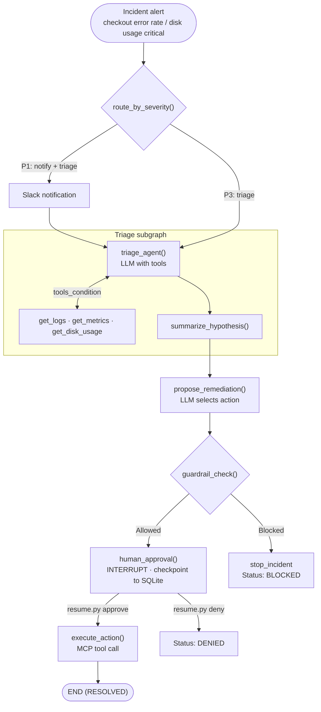

<div align="center">

# SRE Copilot

**Autonomous AI agent for production incident response and remediation**

SRE Copilot automates the response to production incidents. When an alert fires, it investigates the root cause using available data sources, proposes a remediation, validates that action against safety constraints, and executes it once a human approves. The goal is to cut mean-time-to-resolution (MTTR) from 10+ minutes to 1-2 minutes while keeping people in control of critical decisions.

[](https://www.python.org/)
[](https://github.com/langchain-ai/langgraph)
[](https://modelcontextprotocol.io/)
[](https://groq.com/)
[](#known-limitations--work-in-progress)

</div>

---

## Key features

| Feature | Description |
| --- | --- |
| **Autonomous investigation** | LLM-driven agents gather logs, metrics, and disk usage from services |
| **Root cause analysis** | Generates confidence-scored hypotheses about the underlying problem |
| **Intelligent remediation** | Proposes context-appropriate fixes from a set of safe, pre-approved actions |
| **Safety guardrails** | Hard deny-lists, per-service whitelisting, and rate limiting per incident |
| **Human-in-the-loop** | Requires explicit human approval before any remediation runs |
| **Incident resumption** | Persists agent state to SQLite so workflows can pause for approval and resume later |
| **Full audit trail** | Records every step of the incident lifecycle in a timeline |
| **Multi-severity routing** | P1 alerts trigger an immediate Slack notification; P3 alerts go straight to investigation |

---

## Tech stack

| Category | Technology | Role |
| --- | --- | --- |
| **Language** | Python 3.11 | Runtime |
| **Orchestration** | LangGraph 1.2.11 | Workflow state machine |
| **LLM framework** | LangChain 0.22+ | Model and tool abstractions |
| **LLM inference** | Groq API | Model inference |
| **Validation** | Pydantic 2.13+ | Data validation and structured outputs |
| **Tool abstraction** | Model Context Protocol (MCP) 1.29+ | Tool layer across process boundaries |
| **MCP server** | FastMCP 3.4.7 | Implements the ops tool server |
| **Persistence** | SQLite, AsyncSqliteSaver, aiosqlite 0.22+ | Async checkpointing of incident state |
| **GitHub integration** | GitHub MCP Server | Opens PRs for reversions |
| **Slack integration** | Slack MCP Server | Incident notifications |
| **Observability** | LangSmith (optional) | Tracing and debugging |

---

## Architecture



### Key architectural decisions

- **StateGraph + checkpointing.** LangGraph's state machine combined with SQLite checkpointing makes workflows resumable. The entire `IncidentState` is persisted before the `human_approval` interrupt.
- **MCP for tool abstraction.** External systems (ops, GitHub, Slack) are reached through the Model Context Protocol, so tool calls cross subprocess boundaries without tight coupling.
- **Tool-calling LLM loop.** The triage subgraph is agentic: the LLM decides which tools to call, reads the results, and chooses whether to call more tools or finish the analysis.
- **Structured output.** The LLM must return `Hypothesis` and `RemediationProposal` objects as JSON schema, so downstream code always receives valid, typed data.

---

## Getting started

### Prerequisites

- **Python 3.11+**
- **venv** (comes with Python)
- **npm** (for the Slack MCP server; optional if Slack isn't needed)
- **Docker** (for the GitHub MCP server; optional if GitHub isn't needed)
- **API keys:**
  - Groq API key (free tier available)
  - GitHub PAT (if using GitHub integration)
  - Slack bot token (if using Slack integration)

### Installation

**1. Clone and navigate to the project:**

```bash
cd /path/to/agent_project/backend
```

**2. Create and activate a virtual environment:**

```bash
python -m venv venv
.\venv\Scripts\activate      # Windows
source venv/bin/activate      # macOS/Linux
```

**3. Install dependencies:**

```bash
pip install -r requirements.txt
```

> **Note:** `requirements.txt` is not yet in the repository. Install the key packages manually:
>
> ```bash
> pip install langgraph langchain langchain-groq pydantic python-dotenv
> pip install groq langsmith httpx aiosqlite
> pip install mcp fastmcp
> ```

**4. Set up environment variables:**

Copy the template and fill in your credentials:

```bash
cp .env.example .env
```

Then edit `.env` with the following variables:

| Variable | Description | Required | Example |
| --- | --- | --- | --- |
| `GROQ_API_KEY` | API key for Groq LLM inference | Yes | `gsk_...` |
| `MODEL` | LLM model identifier (Groq-compatible) | No | `openai/gpt-oss-20b` or `mixtral-8x7b-32768` |
| `LANGSMITH_TRACING` | Enable LangSmith debugging (true/false) | No | `true` |
| `LANGSMITH_API_KEY` | LangSmith API key (if tracing is enabled) | No | `lsv2_pt_...` |
| `LANGSMITH_ENDPOINT` | LangSmith API endpoint | No | `https://api.smith.langchain.com` |
| `LANGSMITH_PROJECT` | LangSmith project name | No | `sre_copilot` |
| `GITHUB_PERSONAL_ACCESS_TOKEN` | GitHub PAT for MCP integration | No | `github_pat_...` |
| `SLACK_BOT_TOKEN` | Slack bot token for notifications | No | `xoxb-...` |
| `SLACK_APPROVAL_CHANNEL` | Slack channel for approval requests | No | `#incidents` |
| `SLACK_MCP_COMMAND` | Command to launch the Slack MCP server | No | `npx` |
| `SLACK_MCP_ARGS` | Arguments for the Slack MCP server | No | `-y @slack/mcp-server` |

---

## Running locally

**Start an investigation (P3, standard workflow):**

```bash
python main.py --scenario checkout --severity P3
```

**Start a P1 incident (urgent, sends an immediate Slack notification):**

```bash
python main.py --scenario disk --severity P1
```

**Available scenarios:**

| Scenario | Description |
| --- | --- |
| `checkout` | High error rate on checkout-service due to connection pool exhaustion |
| `disk` | payments-worker disk usage critical, unable to write job results |

**What to expect:**

1. Investigation runs automatically.
2. A hypothesis is generated (root cause and confidence).
3. A remediation action is proposed.
4. Guardrails validate the action.
5. If guardrails pass, the system pauses for human approval and the CLI displays `python resume.py <thread_id> approve`.

**Resume with approval:**

```bash
python resume.py 1b9cf3fb approve
```

**Resume with denial:**

```bash
python resume.py 1b9cf3fb deny "Safety concern: insufficient testing"
```

---

## Usage

### Workflow example: checkout service outage

**1. Start the investigation:**

```bash
$ python main.py --scenario checkout --severity P3

scenario: checkout   severity: P3   thread_id: 1b9cf3fb
================================================================
INCIDENT REPORT
================================================================
Alert:   High error rate (>20%) on checkout-service for the last 15 minutes.
Status:  PENDING APPROVAL

--- Triage ---
Hypothesis:  Connection pool exhaustion from recent deploy (reduce 20→5)
Confidence:  0.92
Evidence:
  - error_rate_pct: 23.4
  - latency_p99_ms: 4980
  - pool_capacity_pct: 98
  - log: connection pool at 100% capacity

--- Remediation ---
Proposed:   restart_service(checkout-service)
Reasoning:  Restarting will restore pool to default size
Guardrail:  ALLOWED (passed all checks)

--- Timeline ---
1. triage hypothesis: Connection pool exhaustion...
2. proposed: restart_service(checkout-service)
3. guardrail: allowed (passed all checks)
================================================================

Resume with:
  python resume.py 1b9cf3fb approve
  python resume.py 1b9cf3fb deny "reason here"
```

**2. A human reviews and approves:**

```bash
$ python resume.py 1b9cf3fb approve

--- Remediation ---
Approval:   APPROVED
Executed:   restart_service(checkout-service) -> ok

--- Timeline ---
...
4. human approval: approved
5. executed restart_service(checkout-service) -> ok
================================================================
```

### Command-line arguments

```
python main.py [OPTIONS]

Options:
  --scenario {checkout,disk}  Incident scenario to simulate (default: checkout)
  --severity {P1,P3}          Incident severity level (default: P3)
```

---

## Project structure

```text
backend/
├── main.py                       # Entry point; CLI argument parsing
├── graph.py                      # LangGraph workflow definition
├── state.py                      # IncidentState TypedDict schema
├── guardrails.py                 # Safety constraint logic
├── models.py                     # Pydantic data models
├── mcp_client.py                 # MCP server integration layer
├── report.py                     # Incident report formatting
├── resume.py                     # Resumption handler for approvals
├── incident.db                   # SQLite checkpoint database (auto-created)
│
├── process/
│   ├── agents/
│   │   ├── __init__.py
│   │   ├── triage.py             # Investigation agent (LLM + tool loop)
│   │   └── remediation.py        # Remediation agent & execution
│   │
│   └── mock_ops/
│       ├── tools.py              # Simulated service operations
│       └── data.py               # Mock logs & metrics
│
├── mcp_server/
│   ├── server.py                 # FastMCP server for ops tools
│   └── __init__.py
│
├── .env                          # Environment variables (secrets)
├── .env.example                  # Template for .env
├── .gitignore
└── venv/                         # Python virtual environment
```

### Key modules

| Module | Responsibility |
| --- | --- |
| `main.py` | Parses CLI arguments, initializes the incident graph with the SQLite checkpointer, and invokes the workflow |
| `graph.py` | Defines the LangGraph StateGraph; orchestrates triage → proposal → guardrail → approval → execution with conditional routing |
| `process/agents/triage.py` | Builds a subgraph implementing an agentic loop. The LLM is bound to three tools (`get_logs`, `get_metrics`, `get_disk_usage`) and uses `tools_condition` to decide when to call tools versus summarize |
| `process/agents/remediation.py` | Proposes fixes, manages human approval (via `interrupt()`), and executes MCP tool calls |
| `mcp_client.py` | Abstracts subprocess management for MCP servers; provides `call_mcp_tool(name, args, server)` |
| `guardrails.py` | Implements safety checks: denied actions, allowed services, and rate limits |

---

## Testing

The system is currently tested through manual end-to-end scenario runs. No automated test suite is present.

**Manual testing checklist:**

```bash
# Test standard P3 flow
python main.py --scenario checkout --severity P3
python resume.py <thread_id> approve
# Verify: "executed restart_service(checkout-service) -> ok"

# Test P1 flow (checks Slack notification)
python main.py --scenario disk --severity P1
# Verify: P1 notification sent (or warning if Slack unavailable)

# Test guardrail blocking
python main.py --scenario disk --severity P3
# Verify: Guardrail blocks action due to out-of-scope service
# Expected: "Status: BLOCKED (...outside blast radius)"

# Test denial
python main.py --scenario checkout --severity P3
python resume.py <thread_id> deny "Test denial"
# Verify: Status changes to DENIED
```

---

## Known limitations & work in progress

| Area | Limitation |
| --- | --- |
| **Slack** | The npm package `@slack/mcp-server` does not exist in the npm registry. Slack notifications fail gracefully (a warning is logged and the workflow continues). Fix by using an alternative Slack integration or implementing a custom Slack MCP server |
| **GitHub** | The GitHub MCP server runs in Docker. If Docker is unavailable or GitHub isn't needed, the `open_revert_pr` action will fail. Direct GitHub API calls are an alternative |
| **Interface** | CLI-only. There is no REST API, HTTP endpoint, or web UI, so integration with incident management platforms requires an API layer |
| **Data** | `process/mock_ops/` contains simulated logs and metrics. Real integrations would connect to actual services (Prometheus, logs API, Kubernetes, etc.) |
| **Scenarios** | The two pre-configured scenarios (`checkout`, `disk`) are hardcoded. Custom alerts would require parameterization |
| **Automation** | Human approval is required before any remediation runs. This is intentional for safety, but it means there is no true "lights-out" automation |
| **Logging** | Output uses print statements. Production use would need structured logging, metrics export, and observability integration |

---

## Configuration & customization

### Changing guardrails

Edit `guardrails.py`:

```python
ALLOWED_SERVICES = {"checkout-service", "payments-worker", "auth-service"}  # Add services
DENIED_ACTIONS = {"drop_database", "delete_resource"}  # Add blocked actions
MAX_ACTIONS_PER_INCIDENT = 5  # Increase rate limit
```

### Adding new scenarios

Edit `main.py` and add to `ALERTS`:

```python
ALERTS = {
    "checkout": "...",
    "disk": "...",
    "memory_leak": "auth-service memory usage is at 95%"  # Add new
}
```

Then implement the matching mock data in `process/mock_ops/data.py`.

### Changing the LLM model

Edit `.env`:

```bash
# Groq models: mixtral-8x7b-32768, llama-3.1-70b, etc.
MODEL=mixtral-8x7b-32768
```

Or use a different provider, such as OpenAI via `langchain-openai`:

```python
# In process/agents/triage.py
from langchain_openai import ChatOpenAI
llm = ChatOpenAI(model="gpt-4", temperature=0)
```

---

## Architecture decisions & rationale

| Decision | Rationale |
| --- | --- |
| **LangGraph** | Provides a declarative, checkpointable state machine for multi-step workflows and makes resumable workflows possible with minimal code |
| **Structured output (Pydantic)** | LLMs are probabilistic and sometimes return malformed data. Pydantic validation plus `with_structured_output()` ensures type safety and predictable downstream behavior |
| **MCP (Model Context Protocol)** | Decouples tool definitions from implementations. MCP servers run in separate processes, so diverse systems (GitHub, Slack, custom ops tools) integrate without direct imports. Tool servers can also be load-balanced or auto-scaled independently |
| **SQLite checkpointing** | Simple, embedded, and needs no external database. Sufficient for single-instance or low-concurrency use. For high concurrency, upgrade to PostgreSQL via `langgraph_checkpoint_postgres` |
| **Human approval (interrupts)** | Autonomous AI making infrastructure changes is high-risk. Explicit approval maintains accountability, allows last-minute vetoes, and gives the agent a feedback loop from human decisions |

---

## Contributing

This is a reference implementation for SRE automation using LLM agents. Contributions are welcome. Please:

1. Maintain compatibility with the existing LangGraph + MCP architecture.
2. Add tests for any new scenarios or guardrails.
3. Document new environment variables or configuration options.
4. Preserve the human-in-the-loop design principles.

---

## License

This project is provided as-is for educational and research purposes. See the LICENSE file (if present) for details.

---

## Future work

- [ ] REST API for incident triggering and approval management
- [ ] Web dashboard for incident monitoring and approval UI
- [ ] Real service integrations (Prometheus, ELK, Kubernetes API)
- [ ] Multi-agent collaboration (domain-specific specialists)
- [ ] Feedback loop: track which proposals lead to resolution vs. failure
- [ ] Deployment automation: Docker Compose, Helm charts, CloudFormation
- [ ] PostgreSQL checkpointing for production scale
- [ ] OpenTelemetry integration for observability
- [ ] Cost tracking per incident
